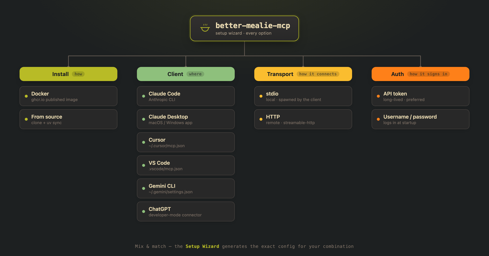

<div align="center">

# 🍲 Better Mealie MCP

<p>
  
  <a href="https://github.com/jlowin/fastmcp"></a>
  
  
</p>
<p>
  <a href="https://github.com/djwmarcx/better-mealie-mcp/actions/workflows/pages.yml"></a>
  <a href="https://github.com/djwmarcx/better-mealie-mcp/actions/workflows/update-spec.yml"></a>
  <a href="https://github.com/djwmarcx/better-mealie-mcp/releases"></a>
  <a href="https://github.com/djwmarcx/better-mealie-mcp/blob/main/.github/renovate.json5"></a>
</p>

<em>An MCP server exposing <strong>every</strong> <a href="https://mealie.io">Mealie</a> API endpoint —<br>
all 250+ operations, none excluded. Manage recipes, meal plans, shopping lists,<br>
households and more from any AI assistant, in natural language.</em>

</div>

---

Built with [FastMCP](https://github.com/jlowin/fastmcp) `from_openapi`: tools are
generated straight from Mealie's OpenAPI spec, so the server stays in sync with
Mealie and nothing is hand-maintained. See [TOOLS.md](./TOOLS.md) for the full
tool list.

## 💬 What can you do with it?

| You say | What happens |
|---------|--------------|
| *"Add a chicken tikka masala recipe from this URL"* | Scrapes and imports the recipe |
| *"What can I cook with what's in my pantry?"* | Searches recipes by your ingredients |
| *"Plan my dinners for next week"* | Creates meal-plan entries |
| *"Build a shopping list for those meals"* | Generates a consolidated shopping list |
| *"Tag all my soups as 'winter'"* | Bulk-updates recipe tags |

## 🧙 Setup Wizard

<h3 align="center">

[**→ Open the Setup Wizard**](https://djwmarcx.github.io/better-mealie-mcp/)

</h3>

<p align="center">
  <a href="https://djwmarcx.github.io/better-mealie-mcp/">
    
  </a>
</p>

Don't hand-write JSON. The wizard walks you through every choice and emits a
ready-to-paste config for **your** combination:

- **Install** — Docker image or from source.
- **Client** — Claude Code, Claude Desktop, Cursor, VS Code, Gemini CLI, or
  ChatGPT (it knows each one's config shape).
- **Connection** — stdio or HTTP, API token or username/password.
- **Limit tools** *(optional)* — trim the 259 tools to just the groups you need,
  for leaner context or clients that cap tool counts. Start from a **pack**
  (*Cooking*, *Meal planning*, *Sharing & browse*, *Admin & users*) or pick
  groups individually; tap a group's ⓘ to see every tool inside it. Your choice
  is baked into the generated config as `MEALIE_INCLUDE_TAGS`.

## 🚀 Setup

**Docker (GHCR image):**

```bash
docker pull ghcr.io/djwmarcx/better-mealie-mcp
docker run -i --rm \
  -e MEALIE_BASE_URL=http://host.docker.internal:9925 \
  -e MEALIE_API_TOKEN=... \
  ghcr.io/djwmarcx/better-mealie-mcp            # stdio; add `--http 8000` for HTTP
```

Images are published on each release, tagged `<mealie-version>` and `latest`.
Inside a container, `localhost` is the container — point `MEALIE_BASE_URL` at
`host.docker.internal` (macOS/Windows) or your host's LAN IP (Linux).

**From source:**

```bash
git clone https://github.com/djwmarcx/better-mealie-mcp
cd better-mealie-mcp
uv sync                     # install deps
cp .env.example .env        # then edit .env with your Mealie URL + token
```

Auth (set in `.env` or the environment):

| Var | Meaning |
|-----|---------|
| `MEALIE_BASE_URL` | Mealie base URL (default `http://localhost:9925`) |
| `MEALIE_API_TOKEN` | Long-lived API token (**preferred**) — Mealie → Profile → Manage API Tokens |
| `MEALIE_USERNAME` / `MEALIE_PASSWORD` | Alternative: logs in at startup to fetch a token |
| `MEALIE_TIMEOUT` | Per-request timeout, seconds (default 60) |
| `MEALIE_VERIFY_SSL` | Verify TLS cert; `false` to accept self-signed (default true) |
| `MCP_SERVER_NAME` | MCP name advertised to clients (default `Mealie`) |
| `MEALIE_INCLUDE_TAGS` | Expose **only** these API groups, comma-separated (e.g. `recipes,organizers,foods`). Fewer tools = leaner context / fits clients that cap tool counts |
| `MEALIE_EXCLUDE_TAGS` | Expose everything **except** these groups (e.g. `admin,households`) |
| `MEALIE_SLIM_SCHEMAS` | Trim redundant schema noise — default `true` (see modes below) |
| `MEALIE_SLIM_AGGRESSIVE` | Also collapse nullable `anyOf` unions — default `false` |
| `MEALIE_VALIDATE_OUTPUT` | Emit per-tool output schemas + validate results — default `false` |

Groups are the first path segment of the API (`recipes`, `households`, `admin`,
`organizers`, `users`, `explore`, `foods`, `units`, …). Unset = every tool.
`INCLUDE` wins if both are set. See [TOOLS.md](./TOOLS.md) for the current
groups and what's in each, or let the
[Setup Wizard](https://djwmarcx.github.io/better-mealie-mcp/) pick them — its
group picker (with one-click **packs** like *Cooking* or *Meal planning*) fills
`MEALIE_INCLUDE_TAGS` for you.

### Context size (schema detail)

Every tool this server exposes ships its JSON schema to the model on **every**
request — that "idle context" is pure overhead until a tool is actually called.
With all 259 tools the full schemas are ~240k tokens, so the server trims them.
Three preset modes (all endpoints stay callable — only the *schema detail* the
model sees changes):

| Mode | Env | Idle context | What it does |
|------|-----|-------------:|--------------|
| **Lean** *(default)* | *(none — the default)* | **~61k tok** | Drops redundant `title`s (FastAPI auto-generates them from field names) and echoed `default`s, and omits output/response schemas. No loss of callable capability. |
| **Leanest** | `MEALIE_SLIM_AGGRESSIVE=true` | **~51k tok** | Everything Lean does, **plus** collapses nullable `anyOf:[{X},{null}]` unions to `X` (drops the explicit "null allowed" hint). |
| **Full** | `MEALIE_SLIM_SCHEMAS=false`<br>`MEALIE_VALIDATE_OUTPUT=true` | **~240k tok** | Complete, untrimmed input **and** output schemas, with client-side result validation. Use only if your client relies on structured-output schemas. |

Everything the model needs to make a **correct** call (`format`, real
`description`s, required fields) is kept in every mode. Combine with tag
filtering above to shrink further — the
[Setup Wizard](https://djwmarcx.github.io/better-mealie-mcp/) shows a live token
estimate for your exact combination.

## ▶️ Run

```bash
uv run better-mealie-mcp             # stdio transport (for MCP clients)
uv run better-mealie-mcp --http 8000 # streamable-http on 127.0.0.1:8000
uv run server.py                     # same server, back-compat entry
fastmcp run fastmcp.json             # via FastMCP project config (stdio)
fastmcp run fastmcp-http.json        # via FastMCP project config (http)
```

In `--http` mode the bind address comes from `MCP_HOST` (default `127.0.0.1`;
the Docker image sets `0.0.0.0` so `-p` port mapping works).

## 🧪 Test against a local Mealie (Docker)

```bash
docker run -d --name mealie -p 9925:9000 \
  -e ALLOW_SIGNUP=true -e BASE_URL=http://localhost:9925 -e TZ=UTC \
  ghcr.io/mealie-recipes/mealie:latest
```

Default admin login: `changeme@example.com` / `MyPassword`.

## 📝 Notes

- **Exposing every endpoint is a lot of tools — a lot of idle context.** Most
  clients handle it fine. If yours caps tool counts or you want a leaner
  context, trim the toolset with `MEALIE_INCLUDE_TAGS` / `MEALIE_EXCLUDE_TAGS`
  (see [Setup](#-setup)) or the wizard's group picker.

### Versioning

**This MCP's version mirrors the Mealie version its spec targets** — MCP
`3.20.1` ⇒ Mealie `v3.20.1`. The server advertises it to clients, and
[VERSIONS.md](./VERSIONS.md) maps every release to its Mealie version and date.

`openapi.json` is a vendored copy of Mealie's spec. The
[`update-spec`](.github/workflows/update-spec.yml) workflow runs daily and
**auto-tracks the latest stable Mealie release** (`mealie:latest`): it boots that
image, reads its real version from `/api/app/about`
([`MEALIE_VERSION`](./MEALIE_VERSION)), pulls `/openapi.json`, regenerates
[TOOLS.md](./TOOLS.md) + counts, and — **only when the spec actually changed** —
bumps the version and **opens a pull request** (main is protected, so every
change lands via PR). When that PR merges,
[`release-on-spec`](.github/workflows/release-on-spec.yml) cuts a
[release](https://github.com/djwmarcx/better-mealie-mcp/releases) (spec attached,
notes listing added/removed tools). Volatile server-clock defaults are stripped
so an unchanged run is a true no-op.

To freeze on one release instead of tracking latest, set `MEALIE_TAG_DEFAULT` in
the workflow to a specific tag (e.g. `v3.20.1`), or run it manually with a
`mealie_tag` input (`latest`, `nightly`, or any tag).
- A few endpoints (`list_auth_oauth*`) return 500 unless OIDC is configured on
  the Mealie side — that's Mealie behavior, not the server.
